# 数据来源关系(血缘)与统计

更新:2026-09-15。本文回答三个问题:每类数据从哪来、优先走什么渠道、本地化程度如何。

## 一、追溯规则(渠道解析策略)

> **原则:同一数据优先追溯到 git 项目;没有 git 项目的,才允许网页/HTTP 渠道。**

实际解析顺序(`tools/enddata_http.py` 统一实现):

```
1. sources/ 本地 git 克隆      ← 零网络,首选(src/collection/clone_sources.py 维护)
2. data/raw/ 历史缓存             ← 零网络
3. jsdelivr / raw.githubusercontent ← 无配额 HTTP(git 项目文件的网页形态)
4. 一图流 COS(TableCfg 专用)     ← 无 git 的 HTTP 镜像,备源
5. GitHub API blob                ← 有配额,最后兜底
```

注册表:`config/sources.json`(`git.clone` 列出全部 git 源;`sources.*` 记录各源角色与验证状态)。

## 二、血缘关系图

```mermaid
graph TD
    GAME[明日方舟:终末地 游戏本体/官方构建]

    GAME -->|"解包(datamining)"| RMX
    GAME -->|"官方服务(非git)"| SKPORT[Skport/Gryphline API<br>zonai.skport.com 等]
    GAME -->|"官方公告/卡池"| BHAZ

    subgraph GIT1[git:解包数据仓库]
        RMX[rmxlinux/EndfieldData ★主源<br>TableCfg 725表+i18n+Lua+关卡]
        XIABEI[XiaBei-cy/EndfieldData 等 5 个<br>历史对照镜像/测试服快照<br>⚠️ 2026-09-15 审查退役]
    end

    subgraph GIT2[git:官方 API 派生]
        ARCHIVE[daydreamer-json/ak-endfield-api-archive<br>API 响应/版本资源存档]
        SKPORTDOC[AixLnyt/skport-api-docs<br>API 逆向文档]
        BHAZ[BiologyHazard/endfield-archive-library<br>公告/卡池存档]
    end

    subgraph GIT3[git:社区手工精校]
        CALC[JamboChen/endfield-calc<br>320条配方+耗时+电力]
        ZMDGRAPH[CaffuChin0/zmdgraph<br>养成计算器,数据内嵌]
        MIKUN[mikunyaaa/endfield-calculator<br>产线分流计算器]
        EFFRONT[Arknights-yituliu/ef-frontend-v1<br>一图流前端,端点参考]
    end

    subgraph NOWEB[无 git:HTTP/网页渠道]
        FFFDAN_VFS[endfield-assets.fffdan.com vfs<br>游戏资源直取:图标 WebP]
        YITULIU_COS[cos.yituliu.cn/endfield/endfielddata<br>TableCfg HTTP 镜像]
        WIKIS[Wiki/工具站网页<br>gamekee / warfarin / CEP / D.I.G.E. 等]
    end

    RMX -->|"cat-file 本地直读|懒取"| ENDDATA
    YITULIU_COS -.->|"备源(尺寸与rmxlinux有差异)"| ENDDATA
    FFFDAN_VFS -->|"icon/iconUrl 直链"| ENDDATA
    CALC -.->|"craftingTime/电力参考"| ENDDATA
    ZMDGRAPH -.->|"养成数值交叉验证"| ENDDATA
    SKPORT -.->|"玩家数据(规划:用户自选导入)"| ENDDATA
    BHAZ -.->|"公告/卡池(规划)"| ENDDATA
    ARCHIVE -.->|"版本资源 manifest(规划)"| ENDDATA

    subgraph ENDDATA[EndData 本项目]
        FETCH[fetch_tablecfg.py] --> BUILD[collection/build_all.py] --> SITE[data/processed/*.json]
    end

    GAME -.->|"同源旁证:两站消费同一份解包"| FFFDAN_SPA[宏山档案局/天师工具箱<br>消费同一 vfs 后端]
```



**防重复采集说明**:宏山档案局与天师工具箱消费的就是同一份解包 TableCfg(其二进制字符串
与 rmxlinux 仓库同构),因此本项目**只从 git 源取数值**;fffdan vfs 仅用于取
**图标资源**(数值表不含贴图,此项无 git 形态,属"无 git 才用网页"的合法情形)。
一图流 COS 同理:其数值表与 rmxlinux 同源同构,仅作 HTTP 备源,不作主源。

## 二·五、血统确认(2026-09-15 实测)

### 内容世代对比(CharacterTable + i18n)

| 源 | 渠道 | 角色数 | i18n 条数 | 最新角色 | 世代判定 |
|---|---|---|---|---|---|
| rmxlinux/EndfieldData | git 本地 | **33** | **147,603** | chr_0032_lizhiyan | **当前版本(唯一跟版)** |
| luosky/EndfieldDataRmxLinux | git 本地 | 26 | 96,165 | chr_0029_pograni | 2026-03 世代 |
| 一图流 COS | HTTP | 25 | — | chr_0025_ardelia | **开服版世代** |
| XiaBei-cy/EndfieldData | git 本地 | 25 | (独立 i18n 目录) | chr_0012_avywen | 开服版世代 |

共同角色字段逐项一致(稀有度/成长曲线相同;rmxlinux 每角色多 3 个新字段)。
**结论**:四源同出一脉(游戏解包),差别只是解包时点;cos 与 XiaBei 同为开服世代,
内容上是彼此的冗余而非互补;rmxlinux 是唯一持续跟版的数据源。

### 提交频率(近 90 天,2026-09-15 统计)

| 仓库 | 近90天提交 | 最近提交 | 活跃度判定 |
|---|---|---|---|
| JamboChen/endfield-calc | **16** | 2026-09-04 | 最活跃(手工精校持续进行) |
| daydreamer-json/ak-endfield-api-archive | 13 | 2026-09-05 | 活跃(近自动) |
| rmxlinux/EndfieldData | 10 | 2026-09-08 | 活跃(随游戏版本提交) |
| AndreaFrederica/jei-web | 2 | 2026-08-06 | 放缓(数据包趋稳) |

## 二·五·一、数据源审查(2026-09-15)

原则:无新增信息(内容被保留源完全覆盖、或仓库内无数据)的数据源退役;
保留血统最优/质量最高/信息独特者,并优先使用本地 git 克隆。

| 处置 | 源 | 理由 |
|---|---|---|
| ✅ 保留 | rmxlinux/EndfieldData | 唯一跟版(33 角色/725 表),血统最优 |
| ✅ 保留 | jei-web | 森空岛 Wiki 血统(与解包互补):敌人中文名、物品包 |
| ✅ 保留 | endfield-calc | 人工精校(耗时/电力),近 90 天 16 次提交最活跃 |
| ✅ 保留 | ak-endfield-api-archive | 官方 API/资源 manifest 存档(版本监控) |
| ✅ 保留 | skport-api-docs / zmdgraph | API 文档;养成数值交叉验证 |
| ❌ 退役 | luosky / XiaBei / Hengle / lsy-404 / UPON | 旧版备份或测试服子集,内容被 rmxlinux 覆盖 |
| ❌ 退役 | mikunyaaa / ef-frontend-v1 | 仓库内无数据(纯代码),端点已文档化 |

退役源保留在 `config/sources.json` 的 `git.retired`(含复克隆所需信息),需要时可随时恢复。

## 二·六、推荐优先数据来源(按数据类别)

> 图例:P0=当前在用主源 P1=推荐备源 P2=历史对照/参考 R=规划接入

| 数据类别 | 推荐顺序 |
|---|---|
| **数值表 TableCfg** | **P0 rmxlinux(git 本地)** → P1 一图流 COS(HTTP,开服版仅应急)→ P2 luosky/XiaBei(历史) |
| **中文 i18n** | **P0 rmxlinux**(147,603 条,唯一含最新文本) → P2 XiaBei 独立 i18n |
| **图标资源**(头像/职业/物品) | **P0 fffdan vfs**(无 git 形态,唯一渠道);P1 jei-web 森空岛物品包(git,备用) |
| **生产配方结构** | **P0 rmxlinux FactoryCraftTable 家族**(427 条) |
| **配方耗时/电力** | **P0 endfield-calc**(git,最活跃,craftingTime 精校)→ P1 rmxlinux totalProgress(换算待实测) |
| **技能数值(DPS)** | **P0 rmxlinux SkillPatchTable**(509 技能,待加工);参考 endfield-calc 模拟器实现 |
| **敌人中文名** | **P0 jei-web「威胁」分区**(git);备选 Skport wiki 目录(HTTP) |
| **养成数值验证** | **P0 zmdgraph js/data.js**(git 内嵌);P1 本表成长曲线自洽校验 |
| **版本监控** | **P0 rmxlinux main 提交**;P1 fffdan `/version`(HTTP);P2 4n3u manifest |
| **公告/卡池** | **P0 BiologyHazard archive**(git)→ R Skport API |
| **玩家个人数据** | R Skport API(无 git,唯一渠道,需用户凭据) |

## 三、数据类别 × 来源 × 渠道

| 数据类别 | 主源(git) | 备源 | 渠道 | 状态 |
|---|---|---|---|---|
| **数值表 TableCfg**(战斗+生产) | rmxlinux/EndfieldData@main | 一图流 COS(HTTP);XiaBei/luosky 历史对照 | 本地 git 直读 24/24 核心表 | ✅ 在用 |
| **中文文本 i18n** | 同上(TableCfg/I18nTextTable_CN,147,603 条) | — | 本地 git | ✅ 在用 |
| **干员/物品/职业图标** | 无 git 形态 | — | fffdan vfs(HTTP,WebP) | ✅ 在用 |
| **生产配方**(手工/工厂/飞船) | rmxlinux(427 条,同数值表) | endfield-calc 精校 320 条(craftingTime 秒数) | 本地 git | ✅ 在用 |
| **配方制造耗时** | 无解包换算定论 | endfield-calc 手工数据(git) | 本地 git | ⏳ 待校准 |
| **技能/Buff 数值** | rmxlinux SkillPatchTable(509 技能,已抓取) | — | 本地 git | ⏳ 已取未加工 |
| **敌人中文名** | 无(解包哈希为 0) | jei-web 森空岛包「威胁」分区(git) | 本地 git | ⏳ 待接入 |
| **养成数值交叉验证** | zmdgraph(git,数据内嵌 js) | — | 本地 git | 参考 |
| **版本更新监控** | rmxlinux main 提交 + 4n3u manifest(git) | 宏山档案局 /version(HTTP);fffdan_version.py | 本地 git + HTTP | ✅ 在用 |
| **公告/卡池资讯** | BiologyHazard/endfield-archive-library(git) | — | 本地 git | ⏳ 规划 |
| **玩家个人数据**(练度/抽卡) | 无 git(Skport 官方 API) | skport-api-docs 仅为文档(git) | HTTP+签名 | ⏳ 规划(用户自选导入) |

## 四、统计(2026-09-15)

### 本地 git 仓库(`sources/`,已 gitignore)——2026-09-15 审查后

| 指标 | 值 |
|---|---|
| 仓库总数 | **6**(审查前 13,退役 7) |
| 总体积 | **约 299 MB**(大仓库全部 partial 克隆,rmxlinux 1.5GB 仅占 18MB) |
| 主源核心表本地可直读 | **24/24(100%,零网络)** |
| partial 懒取实测 | 首次 13s(经代理)→ 之后 0.02s(纯本地) |

| 仓库 | 体积 | 角色 |
|---|---|---|
| daydreamer-json/ak-endfield-api-archive | 182M | 官方 API 存档 |
| JamboChen/endfield-calc | 69M | 产线精校数据 |
| CaffuChin0/zmdgraph | 31M | 养成计算器 |
| lsy-404/EndfieldGameData | 20M | 测试服历史 |
| Arknights-yituliu/ef-frontend-v1 | 14M | 一图流前端 |
| rmxlinux/EndfieldData | 6.6M | **主源**(partial) |
| 其余 7 个 | <1.1M | 历史对照/文档/工具 |

### 数据集产出(`data/processed/`,构建于 rmxlinux@main 2026-09-08)

| 数据集 | 条数 |
|---|---|
| 干员(含 1 级/满级面板+图标直链) | 33 |
| 物品(含图标直链) | 2829(2808 有图标链接) |
| 生产配方 | 427 |
| 武器 | 79 |
| 敌人(抗性/韧性/霸体) | 381 |

### 渠道健康度

| 渠道 | 配额/限制 | 备注 |
|---|---|---|
| 本地 git | 无 | 首选;更新靠 `clone_sources.py` |
| jsdelivr | 单文件 20MB | GitHub 文件的 CDN 形态 |
| 一图流 COS | 无已知限制 | 备源;尺寸与主源有差异需比对 |
| fffdan vfs | CDN 间歇抖动,需重试 | 图标专用 |
| GitHub API | 60 次/小时(匿名) | 仅 blob 兜底 |

## 五、维护约定

1. 新增数据源时先找 git 项目;确实无 git 的(如 fffdan vfs)才允许 HTTP,并在
   `config/sources.json` 标注 `note` 说明原因。
2. 同一数据出现多个来源时,以「跟版最新 > 结构完整 > 可本地化」排序,其余降级为
   历史对照(参考现有主源/镜像分层)。
3. 更新流程:`python3 src/collection/clone_sources.py`(更新所有 git 源)→ `fetch_tablecfg.py`
   (本地直读)→ `collection/build_all.py` → 提交 `reports/` 变更。
