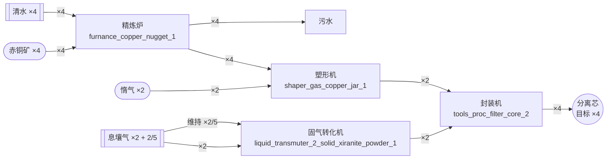
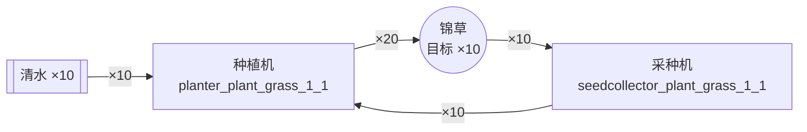
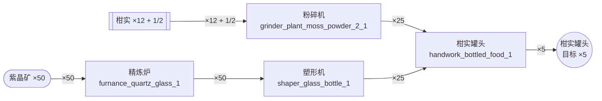

# 配方用料倒推 · 数据概览

- 配方 431 条(manual 102、machine 321、spaceship 8);其中拆解/回收配方(dismantler_)75 条
- 涉及物品:产出 295 种,原料 222 种;无配方最初用料 45 种,可制造 177 种
- 口径:同组/同槽原料同时消耗(AND);副产物不做回收抵扣;多产出配方由 z3 目标函数统一计价(最少制造次数);拆解(dismantler_)配方不列为产出途径
- 环处理:z3 整图线性约束,每种物品一条净流量守恒等式,环与共享中间品天然可解;采集类资源(obtainWays 非空)允许外部供给

## 示例:铁制零件 ×10

```
目标 铁制零件 ×10
铁制零件 ×10
   └─ 蓝铁矿 ×10

需求原料(精确用量 → 实备数量),1 项:
  [最初用料] 蓝铁矿          ×10         → 备料 10(蓝铁矿矿点采集)
产出:目标 铁制零件 ×10
制造步骤:
  component_iron_cmpt_1 ×10 次  蓝铁块*1 --配件机--> 铁制零件*1
  furnance_iron_nugget_1 ×10 次  蓝铁矿*1 --精炼炉--> 蓝铁块*1
使用设备:配件机、精炼炉
环境需求:无特殊气体环境(全部常规)
产出链路图(mermaid):

```

## 示例:分离芯 ×4

```
目标 分离芯 ×4
分离芯 ×4
   └─ 赤铜矿 ×4
   └─ 清水 ×4
   └─ 息壤气 ×2 + 2/5
   └─ 惰气 ×2

需求原料(精确用量 → 实备数量),4 项:
  [最初用料] 赤铜矿          ×4          → 备料 4(赤铜矿矿点采集)
  [外部投料] 清水           ×4          → 备料 4
  [外部投料] 息壤气          ×2 + 2/5    → 备料 3
  [最初用料] 惰气           ×2          → 备料 2(惰气矿点采集)
产出:目标 分离芯 ×4;副产物 污水 ×4(← furnance_copper_nugget_1)
制造步骤:
  furnance_copper_nugget_1 ×4 次  赤铜矿*1+清水*1 --精炼炉--> 赤铜块*1+污水*1
  liquid_transmuter_2_solid_xiranite_powder_1 ×2 次  息壤气*1 --固气转化机(维持息壤气*6/min)--> 息壤*1
  shaper_gas_copper_jar_1 ×2 次  赤铜块*2+惰气*1 --塑形机--> 赤铜耐压罐*1
  tools_proc_filter_core_2 ×2 次  赤铜耐压罐*1+息壤*1 --封装机--> 分离芯*2
使用设备:精炼炉、固气转化机、塑形机、封装机
环境需求:无特殊气体环境(全部常规)
产出链路图(mermaid):

```

## 示例:锦草 ×10

```
目标 锦草 ×10
锦草 ×10
   └─ 清水 ×10

需求原料(精确用量 → 实备数量),1 项:
  [外部投料] 清水           ×10         → 备料 10
产出:目标 锦草 ×10
制造步骤:
  planter_plant_grass_1_1 ×10 次  锦草种子*1+清水*1 --种植机--> 锦草*2
  seedcollector_plant_grass_1_1 ×10 次  锦草*1 --采种机--> 锦草种子*1
使用设备:种植机、采种机
环境需求:无特殊气体环境(全部常规)
产出链路图(mermaid):

```

## 示例:柑实罐头 ×5

```
目标 柑实罐头 ×5
柑实罐头 ×5
   └─ 紫晶矿 ×50
   └─ 柑实 ×12 + 1/2

需求原料(精确用量 → 实备数量),2 项:
  [最初用料] 紫晶矿          ×50         → 备料 50(紫晶矿矿点采集)
  [外部投料] 柑实           ×12 + 1/2   → 备料 13
产出:目标 柑实罐头 ×5
制造步骤:
  furnance_quartz_glass_1 ×50 次  紫晶矿*1 --精炼炉--> 紫晶纤维*1
  grinder_plant_moss_powder_2_1 ×12 + 1/2 次  柑实*1 --粉碎机--> 柑实粉末*2
  handwork_bottled_food_1 ×5 次  柑实粉末*5+紫晶质瓶*5 --手工--> 柑实罐头*1
  shaper_glass_bottle_1 ×25 次  紫晶纤维*2 --塑形机--> 紫晶质瓶*1
使用设备:manual、精炼炉、粉碎机、塑形机
环境需求:无特殊气体环境(全部常规)
产出链路图(mermaid):

```
