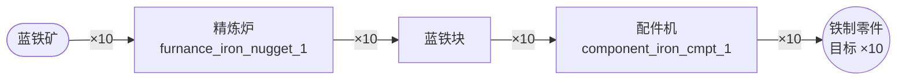
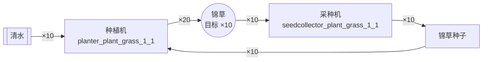
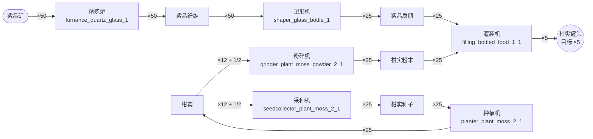

# 配方用料倒推 · 数据概览

- 配方 427 条(manual 102、machine 317、spaceship 8);其中拆解/回收配方(dismantler_)75 条
- 涉及物品:产出 295 种,原料 222 种;无配方最初用料 45 种,可制造 177 种
- 口径:同组/同槽原料同时消耗(AND);副产物不做回收抵扣;配方择路 = 主产物 → machine>manual>spaceship → 耗时短 → id;拆解(dismantler_)配方不列为产出途径
- 环处理:取环上配方表,环内物品守恒下判定需求原料是否净产出 ——净产出即自持环宏配方(净耗继续展开,注记初始占用);不净产出(等量回收环)则换下一产出配方,全败才记外部投料

## 潜在循环依赖(产出图谱,11 组)

以下物品组在图谱上互达成环,倒推时分两类处理:种子↔作物类为**净产环**(自持宏配方,仅需一次性初始占用与清水等净耗);清水⇄水蒸气、块⇄粉末类为**等量回收环**(净产出为零),环上物品由求解器择一记为外部投料(亦可用 --have 指定持有):

- 分离芯 → 壤晶废液 → 息壤 → 息壤气 → 惰性壤晶废液 → 气态赤铜 → 气态赫铜 → 水蒸气 → 污水 → 沉积酸 → 液化息壤 → 清水 → 碳块 → 碳粉末 → 稳定碳块 → 致密碳粉末 → 芽针 → 芽针种子 → 芽针粉末 → 赤铜块 → 赤铜溶液 → 赤铜粉末 → 赤铜耐压罐 → 赫铜块 → 赫铜溶液 → 酸气 → 锦草 → 锦草种子 → 锦草粉末 → 分离芯
- 液化重息壤 → 重息壤 → 重息壤气 → 液化重息壤
- 实验息壤铜气 → 实验息壤铜锭 → 实验息壤铜气
- 晶体外壳 → 晶体外壳粉末 → 晶体外壳
- 柑实 → 柑实种子 → 柑实
- 气态灼铜 → 灼铜块 → 气态灼铜
- 砂叶 → 砂叶种子 → 砂叶
- 紫晶粉末 → 紫晶纤维 → 紫晶粉末
- 荞花 → 荞花种子 → 荞花
- 蓝铁块 → 蓝铁粉末 → 蓝铁块
- 酮化树种 → 酮化灌木 → 酮化树种

## 示例:铁制零件 ×10

```
目标 铁制零件 ×10
铁制零件 ×10
   └─ 蓝铁块 ×10
      └─ 蓝铁矿 ×10
      ⮡ 配方 furnance_iron_nugget_1 ×10 次(蓝铁矿×1 → 蓝铁块×1)
   ⮡ 配方 component_iron_cmpt_1 ×10 次(蓝铁块×1 → 铁制零件×1)

需求原料(精确用量 → 实备数量),1 项:
  [最初用料] 蓝铁矿          ×10         → 备料 10(蓝铁矿矿点采集)
产出:目标 铁制零件 ×10
制造步骤:
  component_iron_cmpt_1 ×10 次  蓝铁块×1 → 铁制零件×1
  furnance_iron_nugget_1 ×10 次  蓝铁矿×1 → 蓝铁块×1
使用设备:配件机、精炼炉
环境需求:无特殊气体环境(全部常规)
产出链路图(mermaid):

```

## 示例:分离芯 ×4

```
目标 分离芯 ×4
分离芯 ×4
   ├─ 赤铜耐压罐 ×2
   │  ├─ 赤铜块 ×4
   │  │  ├─ 赤铜矿 ×4
   │  │  └─ 清水 ×4
   │  │  ⮡ 配方 furnance_copper_nugget_1 ×4 次(赤铜矿×1 + 清水×1 → 赤铜块×1 + 污水×1)
   │  └─ 惰气 ×2
   │  ⮡ 配方 shaper_gas_copper_jar_1 ×2 次(赤铜块×2 + 惰气×1 → 赤铜耐压罐×1)
   └─ 息壤 ×2
      ├─ 稳定碳块 ×4
      │  └─ 致密碳粉末 ×4
      │     └─ 细磨荞花粉末 ×4
      │        ├─ 荞花粉末 ×8
      │        │  └─ 荞花 ×4
      │        │     └─ 荞花种子 ×4
      │        │        ⮡ ⟳ 自持环净产 ×4:planter_plant_moss_1_1×4 次 + seedcollector_plant_moss_1_1×4 次
      │        │     ⮡ 配方 planter_plant_moss_1_1 ×4 次(荞花种子×1 → 荞花×1)
      │        │  ⮡ 配方 grinder_plant_moss_powder_1_1 ×4 次(荞花×1 → 荞花粉末×2)
      │        └─ 砂叶粉末 ×4
      │           └─ 砂叶 ×1 + 1/3
      │              └─ 砂叶种子 ×1 + 1/3
      │                 ⮡ ⟳ 自持环净产 ×1 + 1/3:planter_plant_moss_3_1×1 + 1/3 次 + seedcollector_plant_moss_3_1×1 + 1/3 次
      │              ⮡ 配方 planter_plant_moss_3_1 ×1 + 1/3 次(砂叶种子×1 → 砂叶×1)
      │           ⮡ 配方 grinder_plant_moss_powder_3_1 ×1 + 1/3 次(砂叶×1 → 砂叶粉末×3)
      │        ⮡ 配方 thickener_plant_moss_enr_powder_1_1 ×4 次(荞花粉末×2 + 砂叶粉末×1 → 细磨荞花粉末×1)
      │     ⮡ 配方 furnance_carbon_enr_powder_1 ×4 次(细磨荞花粉末×1 → 致密碳粉末×1)
      │  ⮡ 配方 furnance_carbon_enr_1 ×4 次(致密碳粉末×1 → 稳定碳块×1)
      └─ 清水 ×2
      ⮡ 配方 xiranite_oven_xiranite_powder_1 ×2 次(稳定碳块×2 + 清水×1 → 息壤×1)
   ⮡ 配方 tools_proc_filter_core_2 ×2 次(赤铜耐压罐×1 + 息壤×1 → 分离芯×2)

需求原料(精确用量 → 实备数量),3 项:
  [外部投料(环)] 清水           ×6          → 备料 6
  [最初用料] 赤铜矿          ×4          → 备料 4(赤铜矿矿点采集)
  [最初用料] 惰气           ×2          → 备料 2(惰气矿点采集)
产出:目标 分离芯 ×4;副产物 污水 ×4(← furnance_copper_nugget_1)
制造步骤:
  furnance_carbon_enr_1 ×4 次  致密碳粉末×1 → 稳定碳块×1
  furnance_carbon_enr_powder_1 ×4 次  细磨荞花粉末×1 → 致密碳粉末×1
  furnance_copper_nugget_1 ×4 次  赤铜矿×1 + 清水×1 → 赤铜块×1 + 污水×1
  grinder_plant_moss_powder_1_1 ×4 次  荞花×1 → 荞花粉末×2
  grinder_plant_moss_powder_3_1 ×1 + 1/3 次  砂叶×1 → 砂叶粉末×3
  planter_plant_moss_1_1 ×8 次  荞花种子×1 → 荞花×1
  planter_plant_moss_3_1 ×2 + 2/3 次  砂叶种子×1 → 砂叶×1
  seedcollector_plant_moss_1_1 ×4 次  荞花×1 → 荞花种子×2
  seedcollector_plant_moss_3_1 ×1 + 1/3 次  砂叶×1 → 砂叶种子×2
  shaper_gas_copper_jar_1 ×2 次  赤铜块×2 + 惰气×1 → 赤铜耐压罐×1
  thickener_plant_moss_enr_powder_1_1 ×4 次  荞花粉末×2 + 砂叶粉末×1 → 细磨荞花粉末×1
  tools_proc_filter_core_2 ×2 次  赤铜耐压罐×1 + 息壤×1 → 分离芯×2
  xiranite_oven_xiranite_powder_1 ×2 次  稳定碳块×2 + 清水×1 → 息壤×1
使用设备:封装机、塑形机、精炼炉、天有洪炉、研磨机、粉碎机、种植机、采种机
环境需求:无特殊气体环境(全部常规)
产出链路图(mermaid):

```mermaid
flowchart LR
  I_item_carbon_enr["稳定碳块"]
  I_item_carbon_enr_powder["致密碳粉末"]
  I_item_copper_jar["赤铜耐压罐"]
  I_item_copper_nugget["赤铜块"]
  I_item_copper_ore(["赤铜矿"])
  I_item_filter_core(("分离芯<br/>目标 ×4"))
  I_item_gas_inert(["惰气"])
  I_item_liquid_sewage["污水"]
  I_item_liquid_water[["清水"]]
  I_item_plant_moss_1["荞花"]
  I_item_plant_moss_3["砂叶"]
  I_item_plant_moss_enr_powder_1["细磨荞花粉末"]
  I_item_plant_moss_powder_1["荞花粉末"]
  I_item_plant_moss_powder_3["砂叶粉末"]
  I_item_plant_moss_seed_1["荞花种子"]
  I_item_plant_moss_seed_3["砂叶种子"]
  I_item_xiranite_powder["息壤"]
  R_furnance_carbon_enr_1["精炼炉<br/>furnance_carbon_enr_1"]
  R_furnance_carbon_enr_powder_1["精炼炉<br/>furnance_carbon_enr_powder_1"]
  R_furnance_copper_nugget_1["精炼炉<br/>furnance_copper_nugget_1"]
  R_grinder_plant_moss_powder_1_1["粉碎机<br/>grinder_plant_moss_powder_1_1"]
  R_grinder_plant_moss_powder_3_1["粉碎机<br/>grinder_plant_moss_powder_3_1"]
  R_planter_plant_moss_1_1["种植机<br/>planter_plant_moss_1_1"]
  R_planter_plant_moss_3_1["种植机<br/>planter_plant_moss_3_1"]
  R_seedcollector_plant_moss_1_1["采种机<br/>seedcollector_plant_moss_1_1"]
  R_seedcollector_plant_moss_3_1["采种机<br/>seedcollector_plant_moss_3_1"]
  R_shaper_gas_copper_jar_1["塑形机<br/>shaper_gas_copper_jar_1"]
  R_thickener_plant_moss_enr_powder_1_1["研磨机<br/>thickener_plant_moss_enr_powder_1_1"]
  R_tools_proc_filter_core_2["封装机<br/>tools_proc_filter_core_2"]
  R_xiranite_oven_xiranite_powder_1["天有洪炉<br/>xiranite_oven_xiranite_powder_1"]
  I_item_carbon_enr -->|"×4"| R_xiranite_oven_xiranite_powder_1
  I_item_carbon_enr_powder -->|"×4"| R_furnance_carbon_enr_1
  I_item_copper_jar -->|"×2"| R_tools_proc_filter_core_2
  I_item_copper_nugget -->|"×4"| R_shaper_gas_copper_jar_1
  I_item_copper_ore -->|"×4"| R_furnance_copper_nugget_1
  I_item_gas_inert -->|"×2"| R_shaper_gas_copper_jar_1
  I_item_liquid_water -->|"×4"| R_furnance_copper_nugget_1
  I_item_liquid_water -->|"×2"| R_xiranite_oven_xiranite_powder_1
  I_item_plant_moss_1 -->|"×4"| R_grinder_plant_moss_powder_1_1
  I_item_plant_moss_1 -->|"×4"| R_seedcollector_plant_moss_1_1
  I_item_plant_moss_3 -->|"×1 + 1/3"| R_grinder_plant_moss_powder_3_1
  I_item_plant_moss_3 -->|"×1 + 1/3"| R_seedcollector_plant_moss_3_1
  I_item_plant_moss_enr_powder_1 -->|"×4"| R_furnance_carbon_enr_powder_1
  I_item_plant_moss_powder_1 -->|"×8"| R_thickener_plant_moss_enr_powder_1_1
  I_item_plant_moss_powder_3 -->|"×4"| R_thickener_plant_moss_enr_powder_1_1
  I_item_plant_moss_seed_1 -->|"×8"| R_planter_plant_moss_1_1
  I_item_plant_moss_seed_3 -->|"×2 + 2/3"| R_planter_plant_moss_3_1
  I_item_xiranite_powder -->|"×2"| R_tools_proc_filter_core_2
  R_furnance_carbon_enr_1 -->|"×4"| I_item_carbon_enr
  R_furnance_carbon_enr_powder_1 -->|"×4"| I_item_carbon_enr_powder
  R_furnance_copper_nugget_1 -->|"×4"| I_item_copper_nugget
  R_furnance_copper_nugget_1 -.->|"×4"| I_item_liquid_sewage
  R_grinder_plant_moss_powder_1_1 -->|"×8"| I_item_plant_moss_powder_1
  R_grinder_plant_moss_powder_3_1 -->|"×4"| I_item_plant_moss_powder_3
  R_planter_plant_moss_1_1 -->|"×8"| I_item_plant_moss_1
  R_planter_plant_moss_3_1 -->|"×2 + 2/3"| I_item_plant_moss_3
  R_seedcollector_plant_moss_1_1 -->|"×8"| I_item_plant_moss_seed_1
  R_seedcollector_plant_moss_3_1 -->|"×2 + 2/3"| I_item_plant_moss_seed_3
  R_shaper_gas_copper_jar_1 -->|"×2"| I_item_copper_jar
  R_thickener_plant_moss_enr_powder_1_1 -->|"×4"| I_item_plant_moss_enr_powder_1
  R_tools_proc_filter_core_2 -->|"×4"| I_item_filter_core
  R_xiranite_oven_xiranite_powder_1 -->|"×2"| I_item_xiranite_powder
```

⟳ 自持环 荞花种子:planter_plant_moss_1_1 ×4 次 + seedcollector_plant_moss_1_1 ×4 次,循环内 荞花 守恒,每轮净产 荞花种子 ×1;需一次性初始占用 1 个环内物品(如 荞花),此后循环内守恒
⟳ 自持环 砂叶种子:planter_plant_moss_3_1 ×1 + 1/3 次 + seedcollector_plant_moss_3_1 ×1 + 1/3 次,循环内 砂叶 守恒,每轮净产 砂叶种子 ×1;需一次性初始占用 1 个环内物品(如 砂叶),此后循环内守恒
```

## 示例:锦草 ×10

```
目标 锦草 ×10
锦草 ×10
   ├─ 锦草种子 ×5
   │  └─ 清水 ×5
   │  ⮡ ⟳ 自持环净产 ×5:planter_plant_grass_1_1×5 次 + seedcollector_plant_grass_1_1×10 次
   └─ 清水 ×5
   ⮡ 配方 planter_plant_grass_1_1 ×5 次(锦草种子×1 + 清水×1 → 锦草×2)

需求原料(精确用量 → 实备数量),1 项:
  [外部投料(环)] 清水           ×10         → 备料 10
产出:目标 锦草 ×10
制造步骤:
  planter_plant_grass_1_1 ×10 次  锦草种子×1 + 清水×1 → 锦草×2
  seedcollector_plant_grass_1_1 ×10 次  锦草×1 → 锦草种子×1
使用设备:种植机、采种机
环境需求:无特殊气体环境(全部常规)
产出链路图(mermaid):

⟳ 自持环 锦草种子:planter_plant_grass_1_1 ×5 次 + seedcollector_plant_grass_1_1 ×10 次,循环内 锦草 守恒,每轮净产 锦草种子 ×1;净耗 清水 ×5;需一次性初始占用 1 个环内物品(如 锦草),此后循环内守恒
```

## 示例:柑实罐头 ×5

```
目标 柑实罐头 ×5
柑实罐头 ×5
   ├─ 紫晶质瓶 ×25
   │  └─ 紫晶纤维 ×50
   │     └─ 紫晶矿 ×50
   │     ⮡ 配方 furnance_quartz_glass_1 ×50 次(紫晶矿×1 → 紫晶纤维×1)
   │  ⮡ 配方 shaper_glass_bottle_1 ×25 次(紫晶纤维×2 → 紫晶质瓶×1)
   └─ 柑实粉末 ×25
      └─ 柑实 ×12 + 1/2
         └─ 柑实种子 ×12 + 1/2
            ⮡ ⟳ 自持环净产 ×12 + 1/2:planter_plant_moss_2_1×12 + 1/2 次 + seedcollector_plant_moss_2_1×12 + 1/2 次
         ⮡ 配方 planter_plant_moss_2_1 ×12 + 1/2 次(柑实种子×1 → 柑实×1)
      ⮡ 配方 grinder_plant_moss_powder_2_1 ×12 + 1/2 次(柑实×1 → 柑实粉末×2)
   ⮡ 配方 filling_bottled_food_1_1 ×5 次(紫晶质瓶×5 + 柑实粉末×5 → 柑实罐头×1)

需求原料(精确用量 → 实备数量),1 项:
  [最初用料] 紫晶矿          ×50         → 备料 50(紫晶矿矿点采集)
产出:目标 柑实罐头 ×5
制造步骤:
  filling_bottled_food_1_1 ×5 次  紫晶质瓶×5 + 柑实粉末×5 → 柑实罐头×1
  furnance_quartz_glass_1 ×50 次  紫晶矿×1 → 紫晶纤维×1
  grinder_plant_moss_powder_2_1 ×12 + 1/2 次  柑实×1 → 柑实粉末×2
  planter_plant_moss_2_1 ×25 次  柑实种子×1 → 柑实×1
  seedcollector_plant_moss_2_1 ×12 + 1/2 次  柑实×1 → 柑实种子×2
  shaper_glass_bottle_1 ×25 次  紫晶纤维×2 → 紫晶质瓶×1
使用设备:灌装机、塑形机、精炼炉、粉碎机、种植机、采种机
环境需求:无特殊气体环境(全部常规)
产出链路图(mermaid):

⟳ 自持环 柑实种子:planter_plant_moss_2_1 ×12 + 1/2 次 + seedcollector_plant_moss_2_1 ×12 + 1/2 次,循环内 柑实 守恒,每轮净产 柑实种子 ×1;需一次性初始占用 1 个环内物品(如 柑实),此后循环内守恒
```
